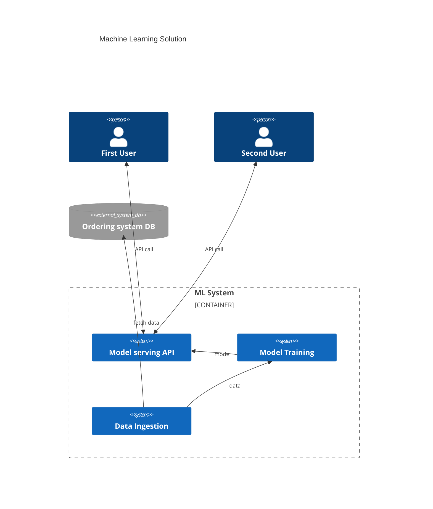
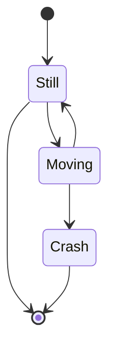

# System Scope and Context {#section-system-scope-and-context}

## Business Context {#_business_context}

**\<Diagram or Table>**

**\<optionally: Explanation of external domain interfaces>**

## Technical Context {#_technical_context}

**\<Diagram or Table>**

**\<optionally: Explanation of technical interfaces>**

**\<Mapping Input/Output to Channels>**
