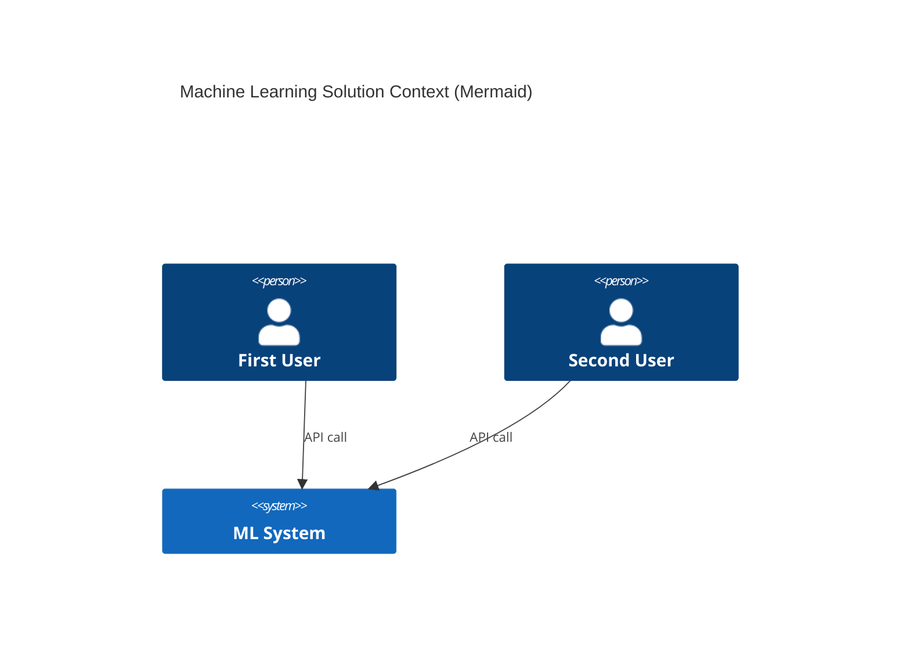
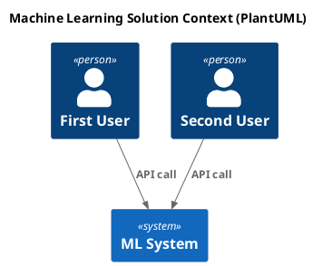
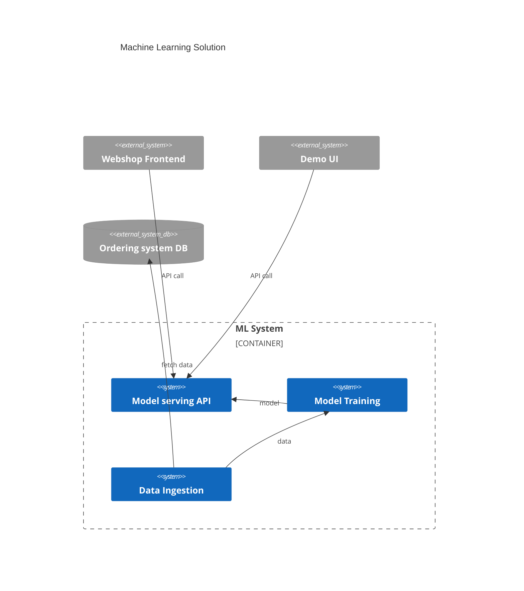

# System Scope and Context

> The context which delimits the system from its (external) communication partners (neighboring systems and users). It specifies or documents the external interfaces. You should always document the context from a business or domain perspective. If infrastructure or specific hardware plays an important role, you might also show a technical perspective.

## Business Context

**Diagram or Table**

**optionally: Explanation of external domain interfaces**

## Technical Context

**Diagram or Table**

**optionally: Explanation of technical interfaces**

**Mapping Input/Output to Channels**
