# Quality Requirements

> Quality requirements, often described as scenarios. You may use a quality tree to provide a high-level overview. The most important quality goals should have been already described in section 1.2. (quality).
> 
> https://docs.arc42.org/section-10/

*Software product quality as defined in ISO 25010.*

## Quality Tree

```mermaid
graph TD
    sys(System Quality Requirements)

    sys --- suitability(" Functional Suitability")
    sys --- reliability(Reliability)
    sys --- efficiency(Performance Efficiency)
    sys --- useability(Useability)
    sys --- security(Security)
    sys --- compatibility(Compatibility)
    sys --- maintainability(Maintainability)
    sys --- transferability(Transferability)

    suitability --- acc("🎯 Accurate predictions")
    reliability --- av("🏃‍♂️ High Availability")
```

## Quality Scenarios

### Accurate Predictions
Predictions on typical user data achieve an accuracy of at least 60%.
- **Quality Aspect**: Functional Suitability
- **Trigger**: 
- **Reaction**:
- **Result**:

